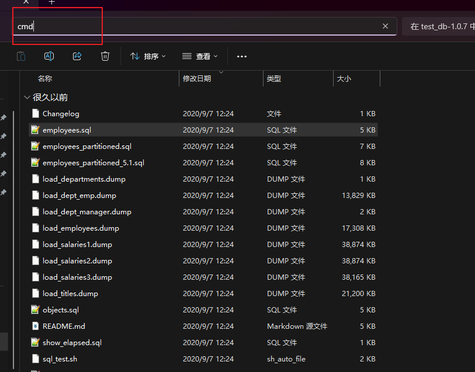
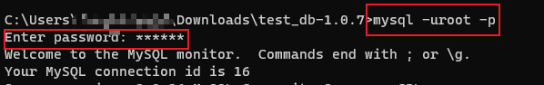
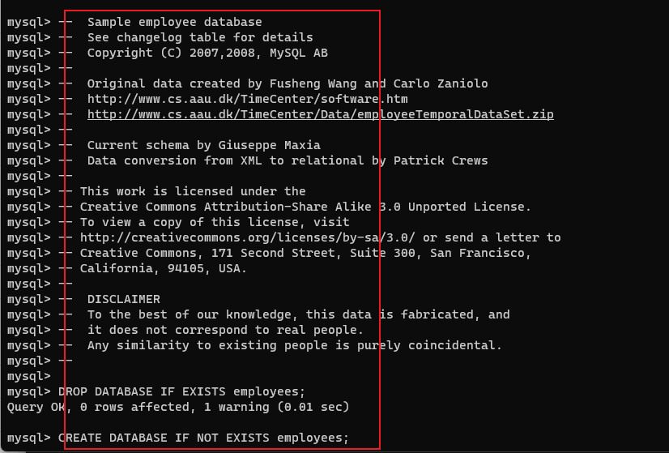
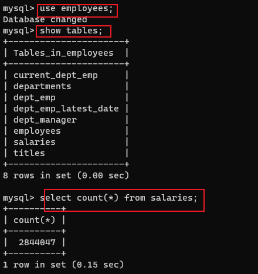
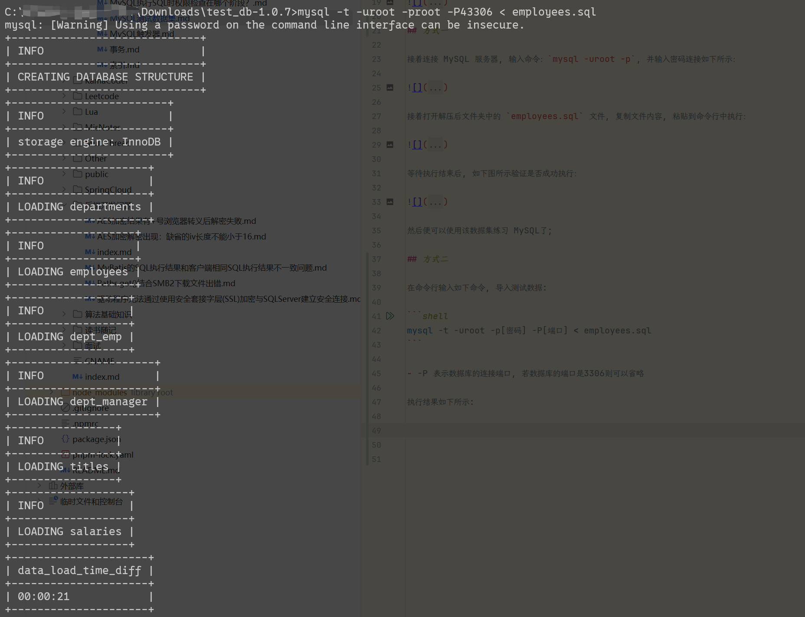
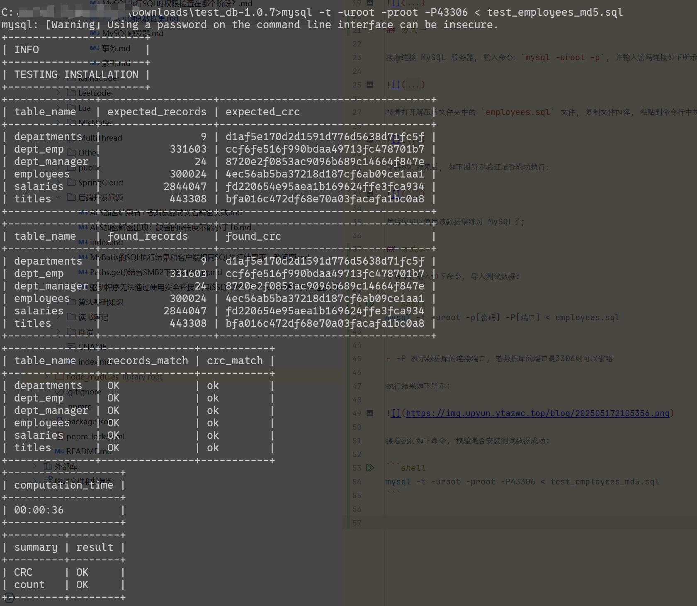

# MySQL测试数据集

MySQL 测试数据集是官方自带的测试数据集合, 最多有百万挑数据, 适合练习MySQL;

官方下载地址：[test_db](https://github.com/datacharmer/test_db)

下载解压后, 在命令行输入 cmd 如下图所示：




## 方式一

接着连接 MySQL 服务器, 输入命令：`mysql -uroot -p`, 并输入密码连接如下所示：




接着打开解压后文件夹中的 `employees.sql` 文件, 复制文件内容, 粘贴到命令行中执行：




等待执行结束后, 如下图所示验证是否成功执行：




然后便可以使用该数据集练习 MySQL了;

## 方式二

在命令行输入如下命令, 导入测试数据:

```shell
mysql -t -uroot -p[密码] -P[端口] < employees.sql
```

- -P 表示数据库的连接端口, 若数据库的端口是3306则可以省略;

执行结果如下所示:




接着执行如下命令, 校验是否安装测试数据成功:

```shell
mysql -t -uroot -p[密码] -P[端口] < test_employees_md5.sql
```
执行结果如下图所示:


