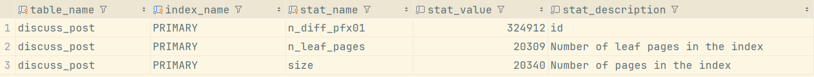
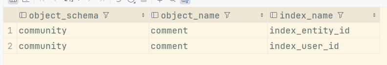

# 索引

## 索引数据结构

**重点问题：**
> 什么是索引?为什么索引能加快查询?
> 
> 索引的数据结构是什么?
> 
> B+树和(B树和红黑树)有什么区别?为什么选择用B+树作为索引数据结构?
> 

### 索引

**索引是提升查询速度的一种数据结构**; 之所以能提升查询速度, 是因为它在插入数据时对数据进行了排序; 所以会存在一个明显的缺点：影响插入或更新的性能;

总之, 有效地设计并创建索引, 可以提升数据库系统的整体性能; 在目前的 MySQL 8.0 版本中, InnoDB 存储引擎支持的索引有 B+ 树索引、全文索引、R 树索引;

一个适合 MySQL 索引的数据结构应该满足以下要求：
1. 能在尽可能少的磁盘 I/O 操作中完成查询工作;
2. 要能高效地查询某一个记录, 也要能高效地执行范围查找


### B+ 树索引结构

> 若对 B+ 树存在疑问, 可查看该文章：[为什么 MySQL 采用 B+ 树作为索引？](https://xiaolincoding.com/mysql/index/why_index_chose_bpuls_tree.html#%E6%80%8E%E6%A0%B7%E7%9A%84%E7%B4%A2%E5%BC%95%E7%9A%84%E6%95%B0%E6%8D%AE%E7%BB%93%E6%9E%84%E6%98%AF%E5%A5%BD%E7%9A%84)进行了解;

B+ 树索引是数据库系统中最为常见的一种索引数据结构, 几乎所有关系型数据库都支持它, **是目前为止排序最有效率的数据结构**, 像二叉树,哈希索引,红黑树,SkipList, 在海量数据基于磁盘存储效率方面都不如 B+ 树索引高效;

> 上述的数据结构一般仅用于内存对象，基于磁盘的数据排序与存储，最有效的依然是 B+ 树索引;

**B+ 树索引特点：** 基于磁盘的平衡树, 树非常矮, 只需要 3~4 层, 能存放千万到上亿的排序数据; 树矮则访问效率高, 只需要 3~4 次IO, 就能查到一条数据;

B+ 树索引由根节点、中间节点、叶子节点组成, 其中只有叶子节点存放排序后的数据, 当高度为1时, 根节点也是叶子节点, 即此时会在根节点存放数据;

对于 B+ 树中每个节点的数据结构可以看：[从数据页的角度看 B+ 树](https://xiaolincoding.com/mysql/index/page.html#innodb-%E6%98%AF%E5%A6%82%E4%BD%95%E5%AD%98%E5%82%A8%E6%95%B0%E6%8D%AE%E7%9A%84)

### B+ 树索引插入性能

虽然 B+ 树在插入时要对数据进行排序, 但是排序的开销并不大, 因为是由 CPU 来负责操作;

**真正的开销是 B+ 树索引的维护, 保证数据排序, 存在两种不同数据类型的插入情况**：
- **数据顺序(逆序)插入**：B+ 树索引的维护代价非常小, 叶子节点都是从左往右进行插入, 比较典型是自增 ID 的插入、时间的插入(若在自增 ID 或 时间列 上创建索引, 插入通常是比较快的);
- **数据无序插入**：B+ 树为了维护排序, 需要对页进行分裂、旋转等开销较大的操作, 另外, 对于硬盘的随机写性能也不如顺序写, 所以磁盘性能也会受到较大影响, 比较典型的是用户昵称, 因为每个用户注册时, 昵称是随意取的, 若在昵称上创建索引, 插入是无序的, 索引维护需要的开销会比较大;

所以对于 B+ 树索引, 主要要求**主键的索引设计尽可能为顺序值**, 比如使用自增, 或使用UUID_TO_BIN 排序的 UUID, 而不用无序值做主键;

### B+ 树索引的设计管理

在 MySQL 数据库中, 可以通过查询表 mysql.innodb_index_stats 查看每个索引情况, 执行如下命令：
```sql
SELECT
    table_name,index_name,stat_name,
    stat_value,stat_description
FROM innodb_index_stats
WHERE table_name = 'discuss_post' and index_name = 'PRIMARY';
```
查询结果如下所示：




从上图可以看出, 表 discuss_post 中的主键索引, 大约有 324912 条数据, 叶子节点一共 20309 个页, 索引所有页的数量为 20340; 所以可以得到非叶子节点为 20340-20309 = 31 个; 即非叶子节点有 31 页;

此外, 对于一张表中的索引数量, 应该**根据具体的业务来创建对应的索引**; 避免创建无用索引;

对于 B+ 树索引的使用情况, 可以在 MySQL 数据库中, 查询表 sys.schema_unused_indexes 来获取哪些索引一直未被使用过, 可以被废弃, 执行命令如下：
```sql
SELECT *
FROM schema_unused_indexes
WHERE object_schema != 'performance_schema';
```

查询结果如下：




`object_schema` 指数据库名, `object_name` 指表名, `index_name`指索引名;

当数据库运行时间较长, 索引创建时间较久, 索引还从未使用过, 则可以考虑删除没用的索引;

此外, 在 MySQL 8.0 中有索引不可见的功能, 在删除索引之前, 可以通过如下命令, 将索引设置为对优化器不可见, 然后观察对业务是否有影响, 若没有影响, 则可以放心的删除无用索引;
```sql
ALTER TABLE 表名
ALTER INDEX 索引名 INVISIBLE/VISIBLE;
```
### 参考资料

- [08 索引：排序的艺术](https://security.feishu.cn/link/safety?target=https%3A%2F%2Flearn.lianglianglee.com%2F%25E4%25B8%2593%25E6%25A0%258F%2FMySQL%25E5%25AE%259E%25E6%2588%2598%25E5%25AE%259D%25E5%2585%25B8%2F08%2520%2520%25E7%25B4%25A2%25E5%25BC%2595%25EF%25BC%259A%25E6%258E%2592%25E5%25BA%258F%25E7%259A%2584%25E8%2589%25BA%25E6%259C%25AF.md&scene=ccm&logParams=%7B%22location%22%3A%22ccm_docs%22%7D&lang=zh-CN)
- [为什么 MySQL 采用 B+ 树作为索引？](https://xiaolincoding.com/mysql/index/why_index_chose_bpuls_tree.html#%E6%80%8E%E6%A0%B7%E7%9A%84%E7%B4%A2%E5%BC%95%E7%9A%84%E6%95%B0%E6%8D%AE%E7%BB%93%E6%9E%84%E6%98%AF%E5%A5%BD%E7%9A%84)
- [数据库索引：为什么MySQL用B+树而不用B树？](http://121.43.36.222:5244/%E8%B5%84%E6%BA%90/14-%E6%9E%81%E5%AE%A2%E6%97%B6%E9%97%B4/%E4%B8%93%E6%A0%8F%E8%AF%BE/2024/230%E5%90%8E%E7%AB%AF%E5%B7%A5%E7%A8%8B%E5%B8%88%E7%9A%84%E9%AB%98%E9%98%B6%E9%9D%A2%E7%BB%8F/10%EF%BD%9C%E6%95%B0%E6%8D%AE%E5%BA%93%E7%B4%A2%E5%BC%95%EF%BC%9A%E4%B8%BA%E4%BB%80%E4%B9%88MySQL%E7%94%A8B+%E6%A0%91%E8%80%8C%E4%B8%8D%E7%94%A8B%E6%A0%91%EF%BC%9F.md)
