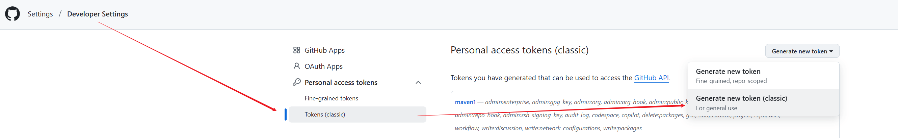
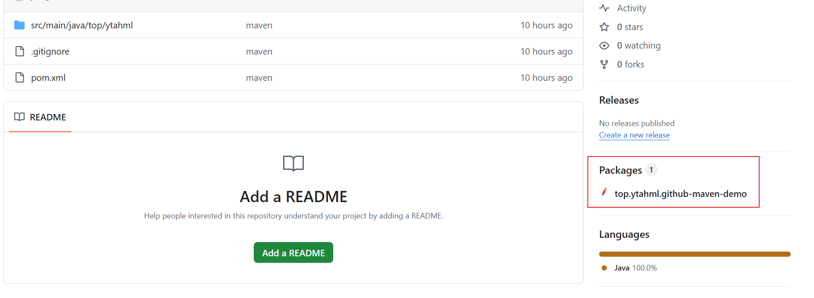

# Github作为中央仓库

## github 管理自定义工具依赖

### github 账号生成token

`点击头像 -> Settings -> 最下面Developer Settings`即可找到生成 token 的界面;




随便给token取个名字, 并指定对应的权限和过期期限即可; 注意只能复制一次;

### 配置setting.xml文件

关键配置如下所示:

```xml
<settings xmlns="http://maven.apache.org/SETTINGS/1.0.0"
  xmlns:xsi="http://www.w3.org/2001/XMLSchema-instance"
  xsi:schemaLocation="http://maven.apache.org/SETTINGS/1.0.0
                      http://maven.apache.org/xsd/settings-1.0.0.xsd">

  <activeProfiles>
    <activeProfile>github</activeProfile>
  </activeProfiles>

  <profiles>
    <profile>
      <id>github</id>
      <repositories>
        <repository>
          <id>central</id>
          <url>https://repo1.maven.org/maven2</url>
          <releases><enabled>true</enabled></releases>
          <snapshots><enabled>true</enabled></snapshots>
        </repository>
        <repository>
          <id>github</id>
          <name>GitHub OWNER Apache Maven Packages</name>
          <!--OWNER替换为 github的用户名或你所属组织的名称；REPOSITORY替换为项目名称（也可以用通配符*表示所有）--><url>https://maven.pkg.github.com/OWNER/REPOSITORY</url>
        </repository>
      </repositories>
    </profile>
  </profiles>

  <servers>
    <server>
      <id>github</id>
      <!--USERNAME替换为 github的用户名-->
      <username>USERNAME</username> 
       <!--TOKEN替换为 上一步中生成的github token -->
      <password>TOKEN</password>
    </server>
  </servers>
</settings>

```

### 配置项目的pom.xml文件

```xml
<distributionManagement>
   <repository>
     <id>github</id>
     <name>GitHub OWNER Apache Maven Packages</name>
      <!--OWNER替换为 github的用户名或你所属组织的名称；REPOSITORY替换为项目名称-->
     <url>https://maven.pkg.github.com/OWNER/REPOSITORY</url>
   </repository>
</distributionManagement>
```

### 创建 maven 项目测试

创建一个demo项目, 并将代码推送到github的仓库中; 按照上述步骤配置之后, 运行命令:

```shell
mvn clean deploy -Dmaven.test.skip=true
```

然后可以在 github 项目页面看到管理的包:




## 参考文章

- [自定义工具包上传至github中央库](https://blog.csdn.net/not_say/article/details/124041168)
- 

