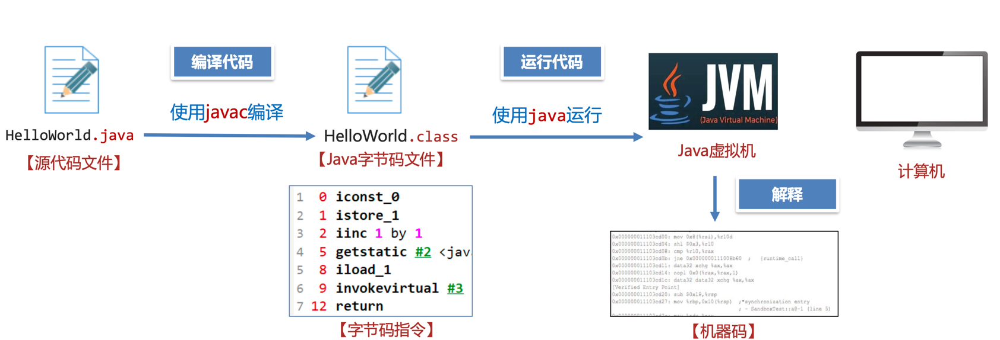
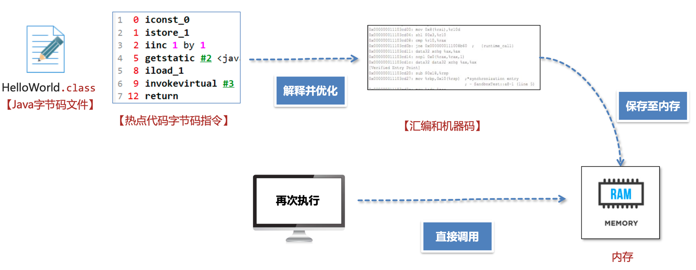
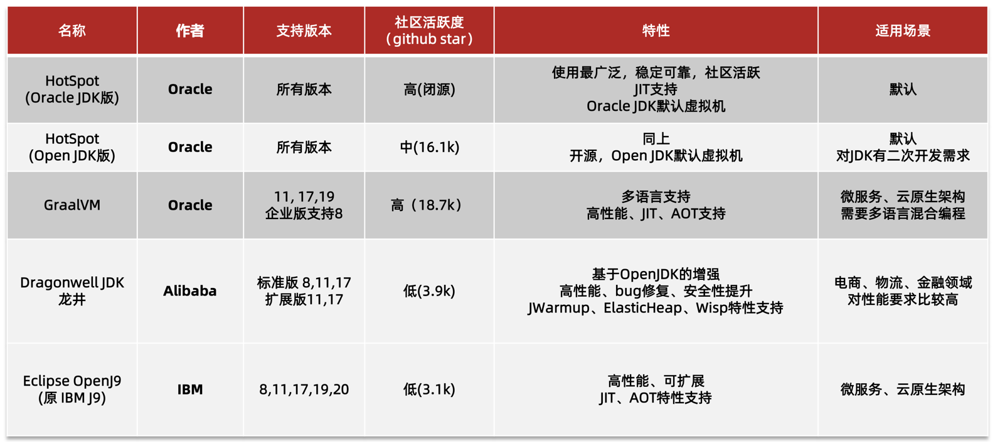

# JVM 初探

## 什么是 JVM

Java 虚拟机(JVM)全称 _Java Virtual Machine_, 本质上是一个在计算机上运行的程序, 专门用来运行 Java字节码文件;

## JVM 功能

### 解释和运行

将字节码文件解释为机器码, 让计算即执行;

### 内存管理

1、为 Java 对象,方法分配内存;

2、垃圾回收机制,自动回收不再使用的对象,提高内存利用率;

### 即时编译(JIT)

> 即使编译(JIT): Just-in-time

虽然 Java 需要在 JVM 上实时解释运行, 性能不如直接运行机器码的 C、C++;

但是 JVM 会对**热点代码**进行编译优化(通过将编译后的机器码保存在内存中, 下次再运行时不需要重复解释为机器码, 直接从内存中快速运行即可), 提高代码执行效率; 

同时因为有JVM 对字节码文件实时解释运行, 所以 Java 只需要对代码进行一次编译, 就可以在不同平台基于 JVM 直接运行, 即保证了跨平台性;

## 常见 JVM

## JVM 规范

> [JVM 规范官网](https://docs.oracle.com/javase/specs/index.html)

JVM 规范由 Oracle 制定, 主要包含 JVM 在设计和实现时需要遵守的规范: class 字节码文件的定义、类和接口的加载和初始化、指令集等内容;

JVM 规范是对虚拟机设计的要求, 不是对 Java 设计的要求, 即虚拟机也可以运行其他语言生成的 class 字节码文件;

## 问题自测

1、JVM 到底是什么?

> JVM 即 Java 虚拟机, 全称 Java Virtual Machine, 是在计算机上运行的程序, 负责运行 Java 字节码文件;

2、JVM 的三大核心功能是什么?

> 1、解释和运行: 解释 Java 字节码文件, 并运行
> 
> 2、内存管理: 为 Java 对象、方法分配内存, 并自动回收不再使用的对象;
> 
> 3、即使编译: JIT, 优化热点代码的编译运行, 提高 Java 执行效率

3、常见的 JVM 虚拟机有哪些?

> HotSpot、DragonWell龙井、GraalVM