# Lua 环境安装

## Windows 环境安装

### 安装官方环境

进入[官方地址](https://www.lua.org/)并点击 Download: 

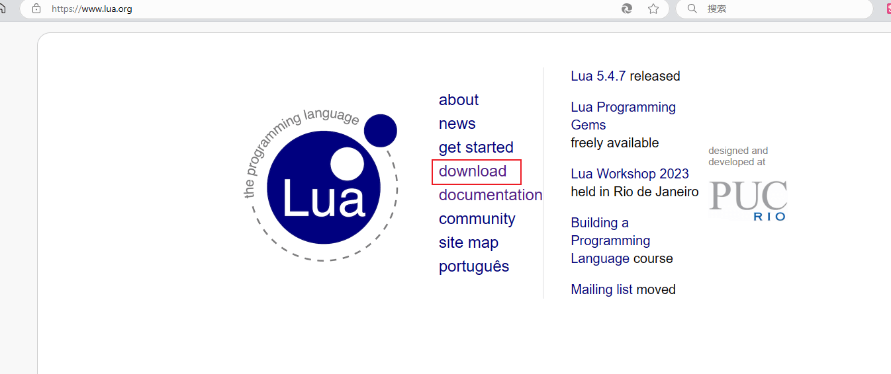

找到并点击 get a binary:

[//]: # (![]&#40;https://img.upyun.ytazwc.top/blog/202411281213927.png&#41;)
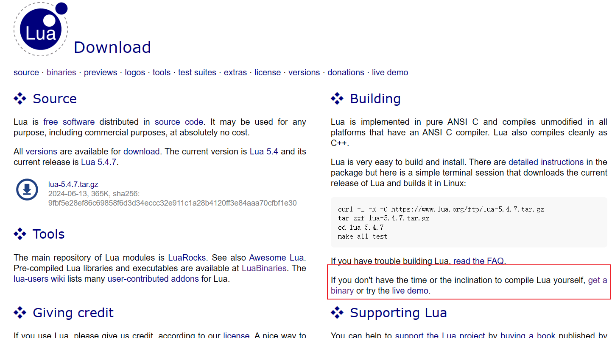

继续选择 Download 并选择对应的版本, 一般选择最新版本即可;

[//]: # (![]&#40;https://img.upyun.ytazwc.top/blog/202411281214636.png&#41;)
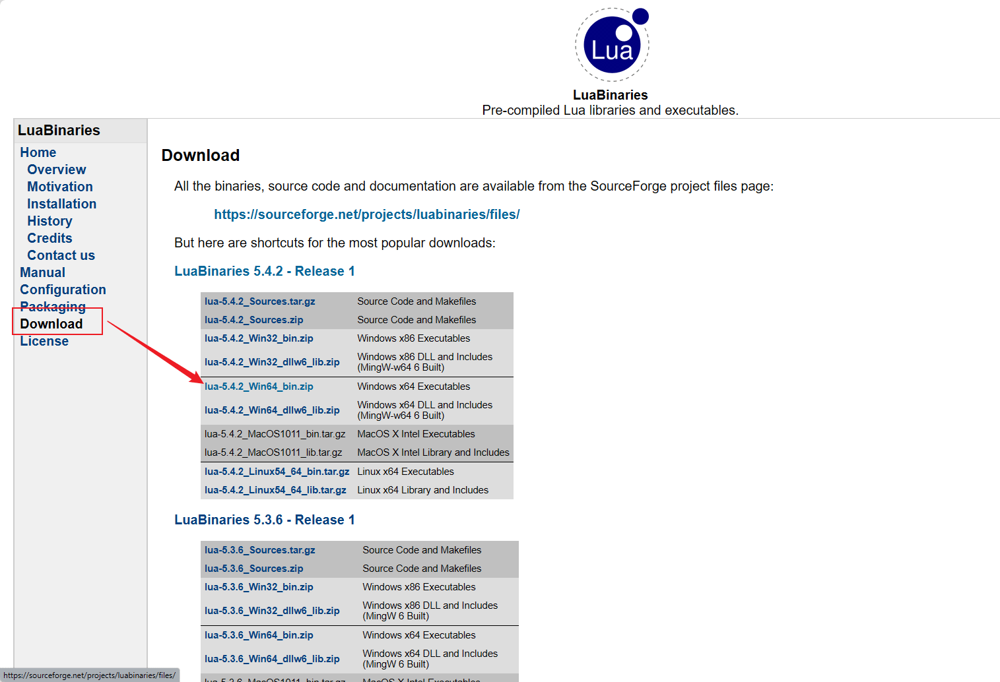

然后解压到不含有中文的指定目录下:

[//]: # (![]&#40;https://img.upyun.ytazwc.top/blog/202411281215372.png&#41;)
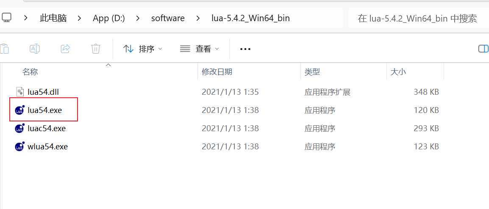


可以将 lua54.exe 文件改名为 lua.exe, 这样调用时输入命令不用输入lua54, 输入lua即可(本人已经安装过lua 5.1.5, 此处不进行改名); 

然后配置系统环境变量:

[//]: # (![]&#40;https://img.upyun.ytazwc.top/blog/202411281217640.png&#41;)
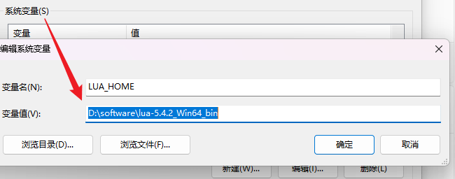

接着配置系统环境变量的PATH变量, 将新增加的 LUA_HOME 添加进去:

[//]: # (![]&#40;https://img.upyun.ytazwc.top/blog/202411281218617.png&#41;)
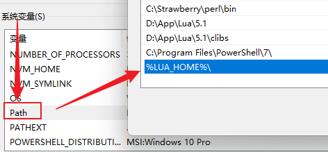

注意添加的值为: `%LUA_HOME%\`, 不要忽略 `\`;

接着打开 cmd 查看环境是否配置成功:

[//]: # (![]&#40;https://img.upyun.ytazwc.top/blog/202411281220222.png&#41;)
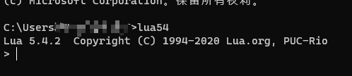

### 安装模拟环境

首先到[下载地址](https://github.com/rjpcomputing/luaforwindows/releases/tag/v5.1.5-52)下载对应环境, 下载结束后运行安装到指定目录即可;

完成下载后, 会有lua语言的命令行工具和编辑器, 如下图所示:

[//]: # (![]&#40;https://img.upyun.ytazwc.top/blog/202411251533652.png&#41;)
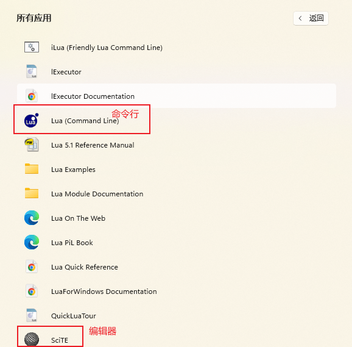

一般更多是使用编辑器来编写 lua 脚本文件;

## 开发编辑器

### SciTE

这是 Windows 环境下, 安装Lua模拟环境时自带的编辑器, 如下图所示:

[//]: # (![]&#40;https://img.upyun.ytazwc.top/blog/202411251536617.png&#41;)
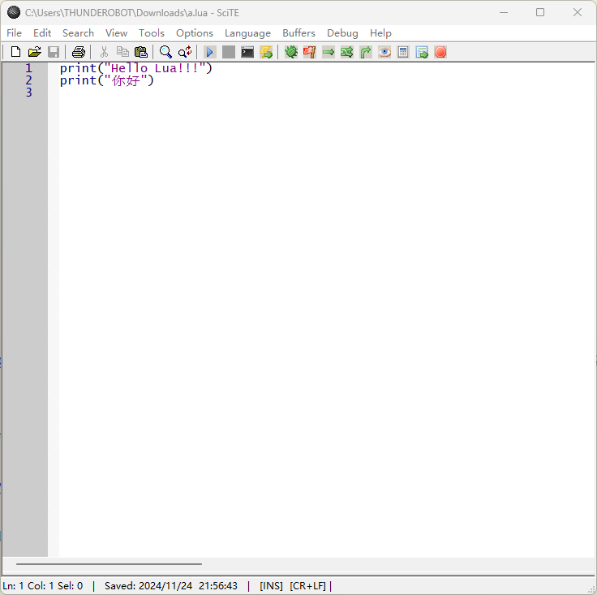

运行脚本时, 可能会出现输出中文乱码问题, 此时打开 `Options` 菜单中的 `Open Global Options File` 全局配置文件;

[//]: # (![]&#40;https://img.upyun.ytazwc.top/blog/202411251539314.png&#41;)
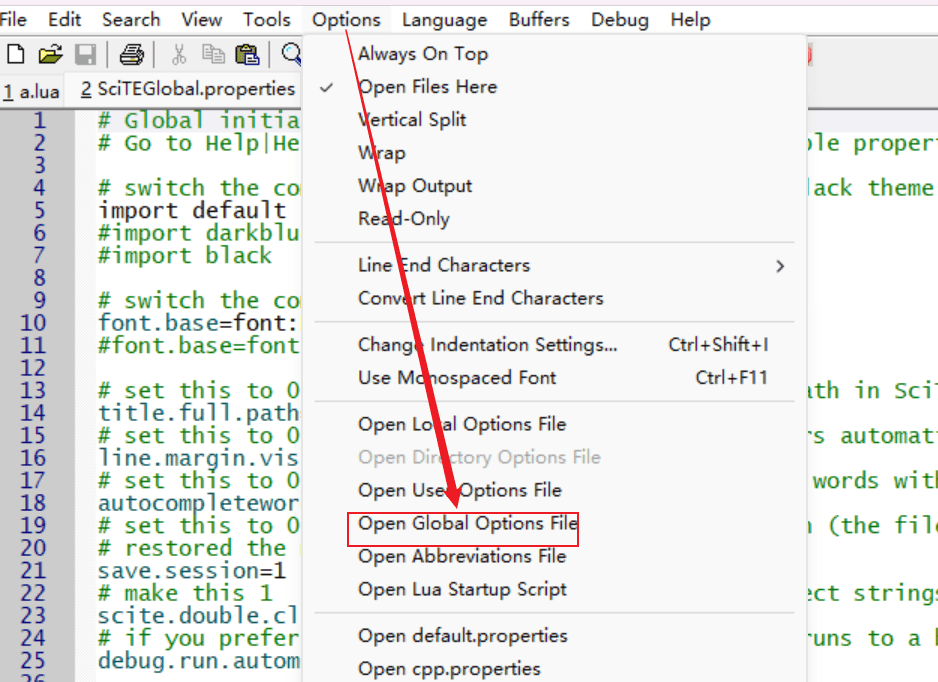

在该配置文件中, 修改如下图所示配置, 即可正确输出中文;

[//]: # (![]&#40;https://img.upyun.ytazwc.top/blog/202411251540979.png&#41;)
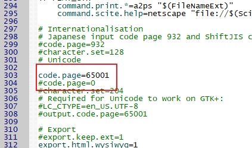

### VS code

是常用的文本编辑器, 可以通过下载lua语言插件, 来配置lua开发环境, 插件如下所示:

- 提供 lua 语言开发环境

[//]: # (![]&#40;https://img.upyun.ytazwc.top/blog/202411251542560.png&#41;)


- 可以用来格式化 lua 代码

[//]: # (![]&#40;https://img.upyun.ytazwc.top/blog/202411251543982.png&#41;)


在命令看板搜索关键字`format`, 并选择格式化文档即可;

同时, 使用VS code开发会有终端运行出现中文乱码问题, 此时在 VS code 的 `setting.json` 环境中, 添加如下配置即可:

```json
{
  "terminal.integrated.profiles.windows": {
    "PowerShell": {
      "source": "PowerShell",
      "overrideName": true,
      "args": [
        "-NoExit",
        "/c",
        "chcp 65001"
      ],
      "icon": "terminal-powershell",
      "env": {
        "TEST_VAR": "value"
      }
    }
  }
}
```

此外可以安装插件 Code Runner 来配置直接运行 lua 文件, 避免需要在 vscode 中连接终端来运行lua脚本命令;

[//]: # (![]&#40;https://img.upyun.ytazwc.top/blog/202411281339868.png&#41;)


## 参考文章

- [Lua 编辑器选择](https://www.kancloud.cn/gxlct008/openresty-best-practices-last/2245158)
- [【已解决】vscode+lua 终端输出中文乱码问题](https://blog.csdn.net/weixin_43206271/article/details/138709102?spm=1001.2101.3001.6650.3&utm_medium=distribute.pc_relevant.none-task-blog-2%7Edefault%7EBlogCommendFromBaidu%7ERate-3-138709102-blog-138059011.235%5Ev43%5Epc_blog_bottom_relevance_base2&depth_1-utm_source=distribute.pc_relevant.none-task-blog-2%7Edefault%7EBlogCommendFromBaidu%7ERate-3-138709102-blog-138059011.235%5Ev43%5Epc_blog_bottom_relevance_base2&utm_relevant_index=6)
- [VSCode配置Lua5.4安装](https://blog.csdn.net/m0_53292003/article/details/139182436)
- [Windows11 下Lua5.4 安装配置](https://blog.csdn.net/weixin_44766268/article/details/128736520)