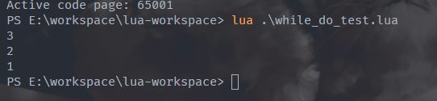
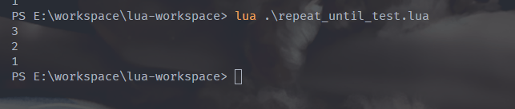
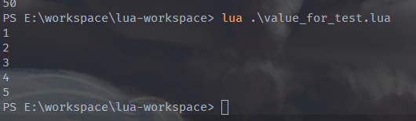
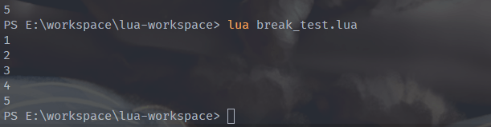

# 循环控制语句

Lua 提供了四种循环控制语句: while...do 循环、repeat...until 循环、数值for循环、泛型for循环;

同时,Lua提供了 break 和 goto 两种循环流程控制语句;

## while...do

循环结束条件放在 while 之后; 示例如下所示:
```lua
-- while_do_test.lua

a = 3;

-- while do 循环
while a > 0 do
    print(a)
    a = a-1 -- 递减
end
```

执行结果如下所示:

[//]: # (![]&#40;https://img.upyun.ytazwc.top/blog/202411271618363.png&#41;)


## repeat...until

循环条件放在 until 之后, 且循环至少会执行一次, 且不同的是**当 until 中的条件成立之后, 循环便会停止运行;** 如下所示:

```lua
-- repeat_until_test.lua

a = 3
repeat
    print(a)
    a = a-1
until a <= 0

```

执行结果如下所示:

[//]: # (![]&#40;https://img.upyun.ytazwc.top/blog/202411271622590.png&#41;)


## 数值for循环

数值 for 循环只参与循环变量为数值型的情况, 语法格式如下所示:

```lua
for var = (起始值, 结束值, 步长) do
    循环体
end
```

即类似于Java中的普通for循环: `for(i = 起始值; i <= 结束值; i = i + 步长)`; 若省略步长, 则默认步长为 1;


简单示例如下所示:

```lua
-- value_for_test.lua

for i = 1, 5 do
    print(i)
end
```

执行结果如下所示:

[//]: # (![]&#40;https://img.upyun.ytazwc.top/blog/202411271646185.png&#41;)


## 泛型for循环

泛型 for 用于遍历 table 中的所有值, 需要与 Lua 的迭代器联合使用; 详见table学习;

## break 关键字

break 语句可以提前终止循环, 且该关键字只能用于循环之中;

示例如下所示:

```lua
-- break_test.lua

for i = 1, 9 do
    print(i)
    if i == 5 then
        break   -- i = 5 时 退出循环
    end
end
```

执行结果如下:

[//]: # (![]&#40;https://img.upyun.ytazwc.top/blog/202411271650045.png&#41;)


## goto 语句

可以将执行流程无条件跳转到指定标记语句处开始执行; 即从标记语句处开始顺序执行往后的所有语句;

此外, 被标记的语句在第一次经过时也会执行, 而不是非得跳转后才能执行;

语句标记: 是使用一对双冒号括起来, 置于语句前面; goto 语句也可以使用在循环之外; 且 Lua 5.1 版本并不支持 爽冒号 的语句标记;


