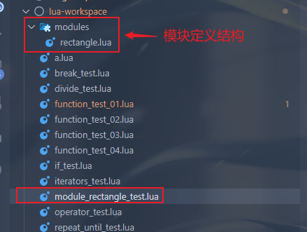
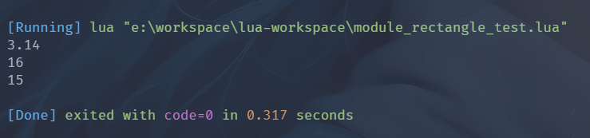
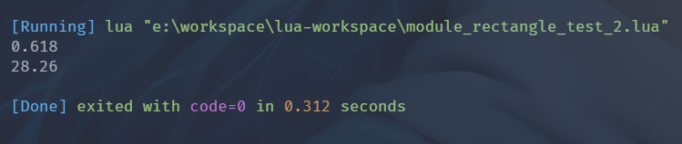

# 模块数据结构

> 模块是 Lua 中特有的一种数据结构, 从 Lua5.1 开始, Lua加入了标准的模块管理机制, 可以把一些公用的代码放在一个文件里, 以 API 接口的形式在其他地方调用, 利于**代码的重用**和**降低代码耦合度**;
> 
> 模块文件主要是由 table 组成, 在 table 中添加相应的变量、函数, 最后文件返回该 table 即可;
> 
> 如果其他文件需要使用模块, 则通过 `require` 导入指定模块;
> 
> 

## 定义模块

模块是一个 lua 文件, 其中会包含一个 table, 一般情况下文件名与 table 名称相同, 但是不是必须的;

简单模块定义示例如下:

```lua
-- 声明一个模块 rectangle 矩形
rectangle = {}

-- 模块变量
rectangle.pi = 3.14

-- 模块函数

-- 获取周长
function rectangle.getPerimeter(a, b)
    return (a + b) * 2
end

-- 以匿名函数方式为模块添加一个函数
rectangle.getArea =
function(a, b)
    return a * b
end

-- 定义与模块无关的内容
-- 定义一个全局变量
goldenRatio = 0.618

-- 定义局部函数 求圆的面积
local function circularArea(r)
    return rectangle.pi * r * r
end

-- 定义一个全局函数 求矩形的最大圆面积
function maxCircularArea(a, b)
    local r = math.min(a, b)
    return circularArea(r)
end

-- 返回模块
return rectangle

```

定义的文件结构如下所示:

[//]: # (![]&#40;https://img.upyun.ytazwc.top/blog/202412032234116.png&#41;)


引入并模块示例如下所示: 

```lua
-- module_rectangle_test.lua

-- 引入模块
local rectangle = require "modules.rectangle"

-- 直接访问模块
-- 模块属性
print(rectangle.pi)

-- 模块方法
print(rectangle.getPerimeter(3, 5)) -- 周长
print(rectangle.getArea(3, 5))

```

执行结果如下所示, 成功导入并使用模块: 

[//]: # (![]&#40;https://img.upyun.ytazwc.top/blog/202412032235213.png&#41;)


引入模块,调用与模块无关的内容示例如下:

```lua
-- module_rectangle_test_2.lua

-- 导入模块
require "modules.rectangle"

-- 访问模块中与模块无关的内容
print(goldenRatio)
-- 调用与模块无关的函数
print(maxCircularArea(3, 5))
```

执行结果如下所示:

[//]: # (![]&#40;https://img.upyun.ytazwc.top/blog/202412032246801.png&#41;)



