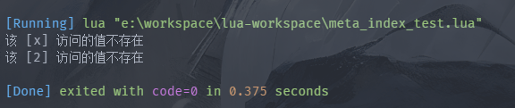
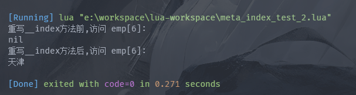
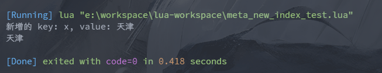
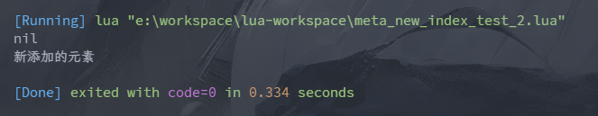
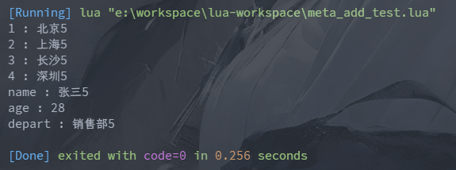
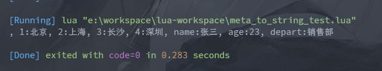
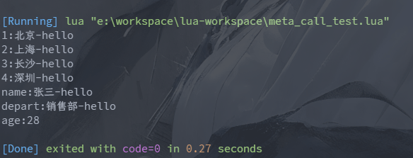
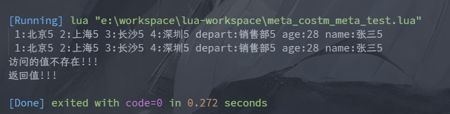

# Lua 元表与元方法

> 元表, 指 Lua 中普通 table 的元数据表, 元方法是原表中定义的普通表的默认行为;

Lua 中每个普通 table 都可为其定义一个元表, 用于扩展该普通 table 的行为功能; 

比如, 对于 table 与数值相加的行为, Lua 中是没有定义的, 但用户可通过为其指定元表来扩展这种行为;

再比如, 用户访问不存在的 table 元素, Lua默认返回的是 nil, 但用户可能并不知道具体情况, 此时可以为该 table 指定元表来扩展该行为: 给用户提示信息, 并返回用户需要的值;

## 重要函数

### setmetatable(table, metatable)

将 metatable 指定为普通表 table 的元表;

### getmetatable(table)

获取指定普通表的 table 的元表

## 常用的元方法

> 更多的元方法参考: https://cloudwu.github.io/lua53doc/manual.html#2.4

### __index 元方法

> 当用户对 table 进行读取时, 如果访问的数组索引或 key 不存在, 则系统会自动调用元表的 `__index` 元方法;
> 

被**重写的 `__index` 元方法, 可以是一个函数, 也可以是另外一个表**; 如果重写的是函数, 有返回值则会直接返回, 如果没有返回值则会返回 nil;


示例一: 被重写的元方法是一个函数

```lua
-- meta_index_test.lua

-- 声明一个元表
local meta = {};

-- 声明一个普通的 table 表
local emp = {
    "北京",
    nil,
    name = "张三",
    age = 23,
    "上海",
    depart = "销售部",
    "长沙",
    "深圳"
};

-- 设置 emp 的元表为 meta
setmetatable(emp, meta);

-- 重写 __index 方法
-- 使用匿名函数进行重写
meta.__index =
    function(tab, key) -- tab 表   key 对应索引或key
        return "该 [" .. key .. "] 访问的值不存在";
    end

print(emp.x);
-- 注意 emp[2] 位置的值为 nil 但是会调用元方法
print(emp[2]);
```

执行结果如下所示:

[//]: # (![]&#40;https://img.upyun.ytazwc.top/blog/202412141813448.png&#41;)


示例二: 重写 `__index` 为一张表

```lua
-- meta_index_test_2.lua

-- 声明一个元表
local meta = {};

-- 声明一个普通的 table 表
local emp = {
    "北京",
    nil,
    name = "张三",
    age = 23,
    "上海",
    depart = "销售部",
    "长沙",
    "深圳"
};

-- 设置 emp 的元表为 meta
setmetatable(emp, meta);

print("重写__index方法前,访问 emp[6]: ")
print(emp[6]);

-- 再定义一张表 用于重写 __index 方法
local other = {};
other[6] = "天津";
other[7] = "西安";

-- 重写 __index 方法 是一张表
meta.__index = other;

print("重写__index方法后,访问 emp[6]: ")
print(emp[6])

-- 即会在 重写的__index表 指定位置获取值
```

执行结果如下:

[//]: # (![]&#40;https://img.upyun.ytazwc.top/blog/202412141823221.png&#41;)


### __newindex 元方法

> 当用户为 table 中一个不存在的索引或 key 赋值时, 会自动调用元表的 `__newindex` 元方法;
> 
> 

该重写的方法, 可以是一个函数, 也可以是一个表; 如果重写的 `__newindex` 元方法是函数, 有返回值则直接返回, 无返回值则返回 nil;

示例一: 重写为一个函数

```lua
-- meta_new_index_test.lua

local emp = {
    "北京",
    name = "张三",
    age = 23,
    "上海",
    depart = "销售部",
    "长沙",
    "深圳"
};

-- 声明元表 并绑定一张表
local meta = {};
setmetatable(emp, meta);

-- 重写__newindex函数 无返回值
function meta.__newindex(tab, key, value)
    print("新增的 key: " .. key .. ", value: " .. value);
    rawset(tab, key, value);    -- 将赋值真正写入到原始表中
end
-- 赋值
emp.x = "天津";
-- nil 无论重写函数是否有返回值 值均为 nil
-- 因为重写函数中 没有将新加入的值 真正的赋值到指定的位置上
-- 可以使用 rawset(tab, key, value) 来真正写入到原始表中
print(emp.x);   
```

执行结果如下所示:

[//]: # (![]&#40;https://img.upyun.ytazwc.top/blog/202412142132998.png&#41;)


示例二: 重写为一个普通表

```lua
-- meta_new_index_test_2.lua

local emp = {
    "北京",
    name = "张三",
    age = 23,
    "上海",
    depart = "销售部",
    "长沙",
    "深圳"
};

-- 声明元表 并绑定一张表
local meta = {};
setmetatable(emp, meta);

-- 定义普通表 用于重写 newindex
local other = {};
meta.__newindex = other;    -- 作用：咱存新增加的数据

-- 此时新添加的元素 会添加到 用于重写__newindex的表 即other中
emp.x = "新添加的元素"

print(emp.x);
print(other.x);

```

执行结果如下:

[//]: # (![]&#40;https://img.upyun.ytazwc.top/blog/202412142134886.png&#41;)


### 运算符元方法

> 如果要为一个表扩展 加号(+)、减号(-)、等于(==)、小于(<) 等运算功能; 可以重写相对应的元方法;
> 
> 比如, 为一个 table 扩展加号(+)运算功能, 可以重写元表的 `__add` 元方法, 而具体运算规则,则定义在重写的元方法中, 当 table 进行加法元算时, 会自动调用重写的 `__add` 元方法;

**运算符元方法如下表所示:**

| 元方法        | 说明        | 元方法      | 说明       |
|------------|-----------|----------|----------|
| `__add`    | 加法, +     | `__band` | 按位与, &   |
| `__sub`    | 减法, -     | `__bor`  | 按位或, \|  |
| `__mul`    | 乘法, *     | `__bxor` | 按位异或, ~  |
| `__div`    | 除法, /     | `__bnot` | 按位非, ~   |
| `__mod`    | 取模, %     | `__shl`  | 按位左移, << |
| `__pow`    | 次幂, ^     | `__shr`  | 按位右移, >> |
| `__unm`    | 取反, -     | `__eq`   | 等于, ==   |
| `__idiv`   | 取整除法, //  | `__lt`   | 小于, <    |
| `__concat` | 字符串连接, .. | `__le`   | 小于等于, <= |
| `__len`    | 字符串长度, #  |          |          |


示例: 重写 `__add` 方法

```lua
-- meta_add_test.lua

local emp = {
    "北京",
    name = "张三",
    age = 23,
    "上海",
    depart = "销售部",
    "长沙",
    "深圳"
};

local meta = {}; -- 元表
setmetatable(emp, meta);

meta.__add = 
    function(tab, num)
        -- 遍历处理tab中的元素
        for k, v in pairs(tab) do
            if type(v) == "number" then
                tab[k] = v + num; -- 数值型 算术元算
            elseif type(v) == "string" then
                tab[k] = v .. num; -- 字符类型 拼接
            end
        end
        return tab; -- 修改好的tab
    end

local emp_add = emp + 5;
for k, v in pairs(emp_add) do
    print(k .. " : " .. v);
end

```

执行结果如下所示:

[//]: # (![]&#40;https://img.upyun.ytazwc.top/blog/202412142159128.png&#41;)


### tostring 元方法

当直接使用 `print(table)` 时, 会自动调用 `__tostring`;

示例如下所示:

```lua
-- meta_to_string_test.lua

local emp = {
    "北京",
    name = "张三",
    age = 23,
    "上海",
    depart = "销售部",
    "长沙",
    "深圳"
};

local meta = {}; -- 元表
setmetatable(emp, meta);

meta.__tostring  = 
    function(tab)
        local str = "";
        for k, v in pairs(tab) do
            str = str .. ", " .. k .. ":" .. v;
        end
        return str;
    end

print(emp);

```

执行结果如下:

[//]: # (![]&#40;https://img.upyun.ytazwc.top/blog/202412142207583.png&#41;)


### __call 元方法

> 当一个 table 以函数的形式来使用时, 系统自动调用重写的 `__call` 元方法;
> 
> 

该方法主要是用来简化对 table 的线管操作, 将对 table 的操作与函数直接相结合;

示例如下所示: 

```lua
-- meta_call_test.lua

local emp = {
    "北京",
    name = "张三",
    age = 23,
    "上海",
    depart = "销售部",
    "长沙",
    "深圳"
};

-- 将原始表与匿名元表相关联
setmetatable(emp, {
    __call = function (tab, num, str)
        -- 遍历 table
        for k, v in pairs(tab) do
            if type(v) == "number" then
                tab[k] = v + num;
            elseif type(v) == "string" then
                tab[k] = v .. str;
            end
        end
        return tab;
    end
})

local call_emp = emp(5, "-hello");
for k, v in pairs(call_emp) do
    print(k .. ":" .. v);
end
```
执行结果如下:

[//]: # (![]&#40;https://img.upyun.ytazwc.top/blog/202412142220157.png&#41;)


## 元表文件

为了方便管理与复用, 可以将元素单独定义为一个文件, 该文件只可以定义一个元表, 且一般文件名与元表名称相同;

若一个文件要使用其他文件中定义的元表, 只需使用 `require "元表文件名"` 即可将元表导入使用;

如果用户想扩展元表而不想直接修改原元表文件, 可以在自己的文件中重写对应功能的元方法即可;

**自定义元表** 文件如下所示:

```lua
-- custom_meta.lua

-- 自定义一个元表

local custom_meta = {
    __add =
    function(tab, num)
        -- 遍历处理tab中的元素
        for k, v in pairs(tab) do
            if type(v) == "number" then
                tab[k] = v + num; -- 数值型 算术元算
            elseif type(v) == "string" then
                tab[k] = v .. num; -- 字符类型 拼接
            end
        end
        return tab; -- 修改好的tab
    end,
    
    __tostring =
    function(tab)
        local str = "";
        for k, v in pairs(tab) do
                str = str .. " " .. k .. ":" .. v;
        end
        return str;
    end
};

return custom_meta;
```

引入自定义元表文件示例如下所示:

```lua
-- meta_custom_meta_test.lua

-- 引入元表
local meta = require "meta.custom_meta";

local emp = {
    "北京",
    name = "张三",
    age = 23,
    "上海",
    depart = "销售部",
    "长沙",
    "深圳"
};

-- 链接元表
setmetatable(emp, meta);

-- 执行元表中已经重写过的元方法
local add_emp = emp + 5;
print(emp);
print(add_emp);

-- 可以继续扩展元表 添加自己需要的方法
meta.__index = function (tab, key)
    print("访问的值不存在!!!");
    return "返回值!!!";
end

print(emp.x);

```

执行结果如下所示:

[//]: # (![]&#40;https://img.upyun.ytazwc.top/blog/202412142310355.png&#41;)

