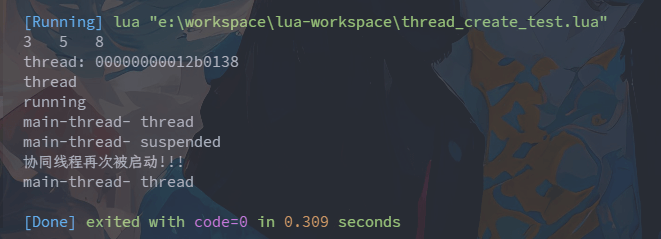
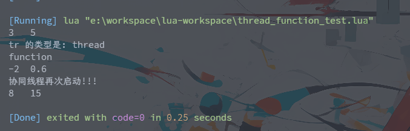

# Lua 的协同线程和协同函数

## 协同线程

Lua 中有一种特殊线程, 称为 `coroutine`, 协同线程, 简称协程;

coroutine 可以在运行时暂停执行, 然后转去执行其它线程; 也可以返回继续执行没有执行完毕的内容; 即可走可停再走;

协同线程也被称为协作多线程, 在 Lua 中表示独立的执行线程; **任意时刻只会有一个协程执行**, 而不会出现多个协程同时执行的情况;

协同线程的类型为 `thread` , 启动、暂停、重启等, 均需要通过函数来控制; 常用函数如下表所示:

| 方法                 | 描述                                                                                  |
|--------------------|-------------------------------------------------------------------------------------|
| create(function)   | 创建一个协同线程实例，即返回的是thread类型。参数是一个function。其需要通过resume()来启动协同线程的执行                      |
| resume(thread,...) | 启动指定的协同线程的执行，使其从开始处或前面挂起处开始执行。可以向create()的内置函数传递相应的参数。如果内置函数具有返回值，resume()会全部接收并返回。 |
| running()          | 返回正在运行的协同线程实例，即thread类型值                                                            |
| yield()            | 挂起协同线程，并将协同线程设置为挂起状态。resume()可从挂起处重启被挂起的协同线程                                        |
| status(thread)     | 查看协同线程的状态。状态有三种：运行态running，挂起态suspended，消亡态dead                                     |
| close()            | 关闭协同线程                                                                              |
| wrap(function)     | 创建一个协同函数，返回的是function类型。一旦调用该函数就会创建并执行一个协同线程实例                                      |

基本示例一: 内置执行函数没有返回值

```lua
-- thread_create_test.lua

-- 创建一个协同线程实例
-- 接收参数 function
crt = coroutine.create(
    function (a, b)
        print(a, b, a + b);
        -- 获取正在运行的协同线程实例，thread类型
        local tr = coroutine.running();
        -- 输出获取的协同线程实例
        print(tr);
        print(type(tr)); -- 获取协同线程的类型
        print(coroutine.status(crt)); -- 查看协同线程的状态
        -- 将协同线程实例 挂起
        coroutine.yield();
        -- 挂起后 后续语句不会执行
        -- 当重新启动后 后续语句才会运行
        print("协同线程再次被启动!!!");
    end
)

-- 启动协同线程
coroutine.resume(crt, 3, 5); -- 函数返回值为内置函数返回值或启动线程的状态
-- 主线程查看协程类型
print("main-thread- " .. type(crt));
-- 在主线程查看线程实例的状态
print("main-thread- " .. coroutine.status(crt));

-- 继续启动协同线程 第二次启动可以不必再传参
coroutine.resume(crt);
-- 再次查看状态
print("main-thread- " .. type(crt));
```

执行结果如下:

[//]: # (![]&#40;https://img.upyun.ytazwc.top/blog/202412162325298.png&#41;)


基本示例二: 内置执行函数有返回值

```lua
-- thread_create_test_2.lua

crt = coroutine.create(
    function (a, b)
        print(a, b);
        -- 将当前协程挂起 并携带两个返回值
        coroutine.yield(a * b, a / b);
        print("协程再次运行!!!");
        -- 返回两个值
        return a+b, a-b;
    end
);

-- 接收参数：启动状态-是否成功，返回值1，返回值2
local success, result_1, result_2 = coroutine.resume(crt, 12, 3);
print(success, result_1, result_2);

-- 继续执行
success, result_1, result_2 = coroutine.resume(crt, 12, 3);
print(success, result_1, result_2);

```

执行结果如下:

[//]: # (![]&#40;https://img.upyun.ytazwc.top/blog/202412162335526.png&#41;)


## 协同函数

协同线程可以单独创建执行, 也可以通过协同函数的调用启动执行;

使用 coroutine 的 wrap() 函数创建的就是协同函数, 类型为 function;

由于协同函数的本质就是函数, 所以协同函数的调用方式就是标准的函数调用方式; 只是, 协同函数的调用会启动内置的协同线程;

协同函数示例如下所示:

```lua
-- thread_function_test.lua

-- 创建一个协同函数
cf = coroutine.wrap(
    function (a, b)
        print(a, b);

        -- 获取当前协同函数创建的协同线程
        local tr = coroutine.running();
        print("tr 的类型是: " .. type(tr));

        -- 挂起当前的协同线程
        coroutine.yield(a-b, a / b);

        print("协同线程再次启动!!!");

        return a+b, a*b;
    end
);
-- 调用协同函数
local r1, r2 = cf(3, 5);
print(type(cf)); -- 协同函数类型
print(r1, r2);

r1, r2 = cf(3, 5); -- 再次启动协同函数 此时的参数是可省略的
print(r1, r2);

-- 另一种重启协同线程方式
-- 将协同函数内的协同线程返回 并接收
-- 然后再次调用协同线程的 resume 方法
```

[//]: # (![]&#40;https://img.upyun.ytazwc.top/blog/202412172248060.png&#41;)

