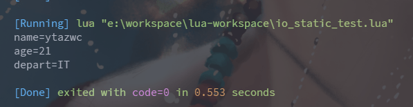
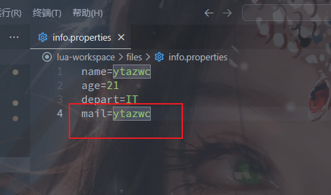
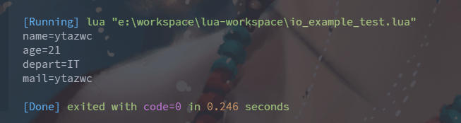
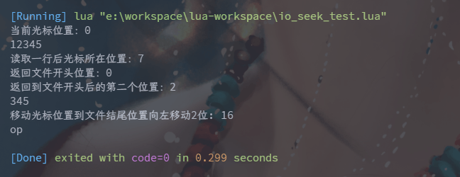

# 14-Lua的文件IO

Lua 提供了大量对文件进行 IO 操作的函数, 这些函数分为两类: 静态函数 和 实例函数;

- 静态函数: 指通过 io.xxx() 方式对文件进行操作的函数;
- 实例函数: 指通过 Lua 中面向对象方式操作的函数;

## 静态函数

首先,创建一个用于 IO 操作的文件文件, 如下所示, 假设文件命名为`info.properties`:

```properties
name=ytazwc
age=21
depart=IT
```

常用静态函数如下所示:

### io.open(filename, mode)

以指定模式打开指定文件, 返回打开文件的句柄(即对应文件的一个对象实例); 

其中模式 mode 有 3 种如下所示:
- r: 只读, 默认模式;
- w: 只写, 写入内容会覆盖文件原有内容;
- a: 只写, 以追加方式写入内容;

模式 mode 可以配合如下 2 个符号使用:
- +: 增加符, 即 r+, w+, a+ 均变为了读写;
- b: 二进制标识符, 如果要操作的文件为二进制文件, 则需要变为 rb, wb, ab;

### io.input(file)

指定要读取的文件;

### io.output(file)

指定要写入的文件;

### io.read(format)

以指定格式读取 io.input() 中指定的输入文件; 

其中 format 格式有:
- *l: 从当前位置的下一个位置开始读取整个行, 默认格式;
- *n: 读取下一个数字, 其将作为浮点数或整数;
- *a: 从当前位置的下一个位置开始读取整个文件;
- number: 这是一个数字, 表示要读取的字符的个数;

### io.write(data)

将指定的数据 data 写入到 io.output() 中指定的输出文件;

示例一: 以读取的方式打开文件

```lua
-- io_static_test.lua

-- 以只读方式打开一个文件
file = io.open("files/info.properties", "r");
-- 指定要读取的文件
io.input(file);

-- 读取一行数据
local line = io.read("*l");

-- 循环读取所有数据
while line ~= nil do
    print(line);
    line = io.read("*l");
end

-- 关闭文件
io.close(file);
```

执行结果如下所示:

[//]: # (![]&#40;https://img.upyun.ytazwc.top/blog/202412182215741.png&#41;)


示例二: 以追加的方式打开文件

```lua
-- io.static_test_2.lua

-- 以追加的方式打开一个文件
file = io.open("files/info.properties", "a");

-- 指定要写入的文件为 file
io.output(file);

-- 写入一行数据
io.write("\nmail=ytazwc");

-- 关闭文件
io.close(file);

```

执行后,打开 info.properties 文件后,结果如下所示:

[//]: # (![]&#40;https://img.upyun.ytazwc.top/blog/202412182219002.png&#41;)


## 实例函数

常用实例函数如下所示:

### file:read()

这里的 file 是调用 io.open() 函数返回的 file, 实际上就是 Lua 中的一个对象; 用法与 io.read() 相同;

### file:write()

用法与 io.write() 相同;

### file:seek(whence, offset)

该函数用于获取或设置文件读写指针的当前位置; 从 1 开始计数, **除文件最后一行外, 每行都有行结束符, 会占用 两个字符 位置**;

> 位置 0 表示文件第一个位置的前面位置;

当 seek() 为无参时, **会返回读写指针的当前位置**;

参数 whence 的值有三种, 表示将指针定位的不同位置, 而 offset 则表示相对于 whence 指定位置的偏移量, 且 offset 默认值为0, 为正表示向后偏移, 为负表示向前偏移;

whence 的取值如下所示:
- set: 表示将指针定位到文件开头处, 即 0 位置处;
- cur: 表示指针保持当前位置不变, 默认值;
- end: 表示将指针定位到文件结尾处;

**示例一**: 只需要简单修改静态函数的示例一, 将其中的读取函数 `input` 替换为 `read` 即可, 如下所示:

```lua
-- io_example_test.lua

-- 以只读方式打开一个文件
file = io.open("files/info.properties", "r");
-- 指定要读取的文件
-- io.input(file);

-- 读取一行数据
-- local line = io.read("*l");
local line = file:read("*l");   -- 替换为实例函数 read     // [!code ++]

-- 循环读取所有数据
while line ~= nil do
    print(line);
    -- line = io.read("*l");
    line = file:read("*l"); -- 替换为实例函数 read     // [!code ++]
end

-- 关闭文件
-- io.close(file);
file:close();   -- 替换为实例函数 close    // [!code ++]

```

执行结果如下所示:

[//]: # (![]&#40;https://img.upyun.ytazwc.top/blog/202412182224713.png&#41;)


**示例二**: 测试 `seek()` 函数

重新创建一个新的文件, 取名为 `test_seek.txt` 如下所示:

```txt
12345
ytazwc
top
```

代码如下所示:

```lua
-- io_seek_test.lua

-- 以只读方式打开文件
file = io.open("files/test_seek.txt", "r");

local pos = file:seek(); -- 读取光标所在位置
print("当前光标位置：" .. pos);

-- 读取一行数据
local line = file:read("*l");
print(line);

pos = file:seek();  -- 读取一行后光标所在位置
print("读取一行后光标所在位置：" .. pos);   -- 此时光标应该指向第一行的行结束符位置 即该行长度+2

pos = file:seek("set"); -- 返回文件开头位置
print("返回文件开头位置：" .. pos);

pos = file:seek("set", 2); -- 返回文件开头位置后的第2个位置
print("返回到文件开头后的第二个位置：" .. pos);

-- 再次读取一行
line = file:read("*l"); -- 是从光标位置的下一个位置开始读取
print(line);

-- 移动光标位置到文件结尾位置向左移动2位
pos = file:seek("end", -2);
print("移动光标位置到文件结尾位置向左移动2位: " .. pos);

-- 再次读取一行
line = file:read("*l");
print(line);

-- 关闭文件
file:close();
```

运行结果如下所示:

[//]: # (![]&#40;https://img.upyun.ytazwc.top/blog/202412182247872.png&#41;)

