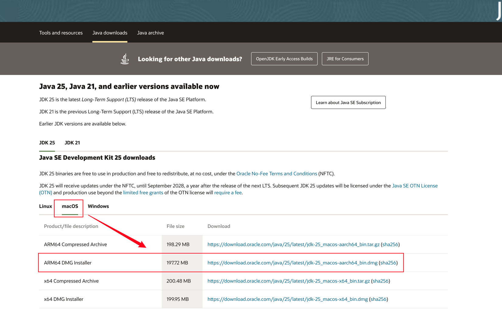
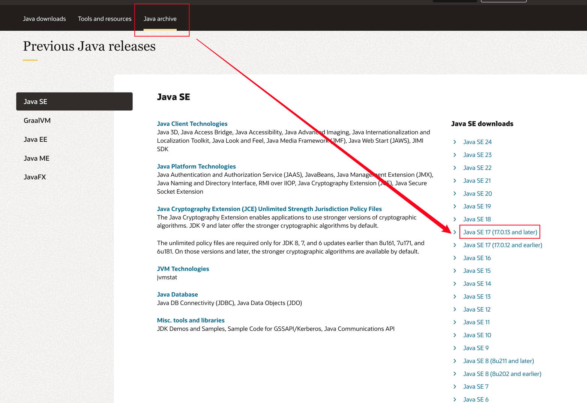
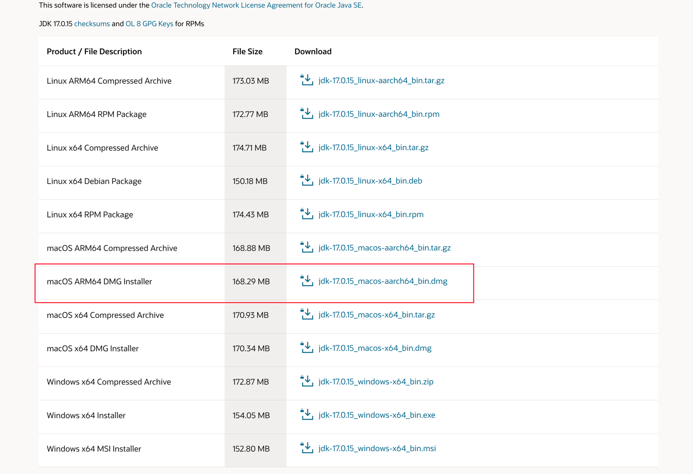
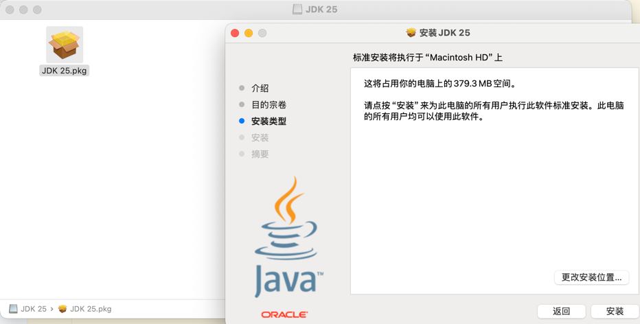
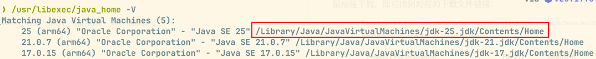
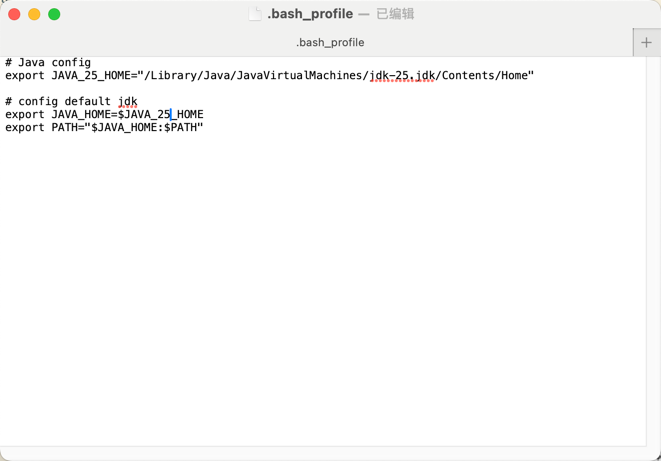
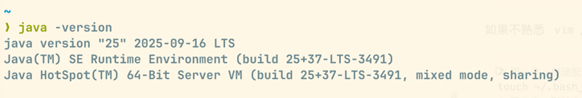
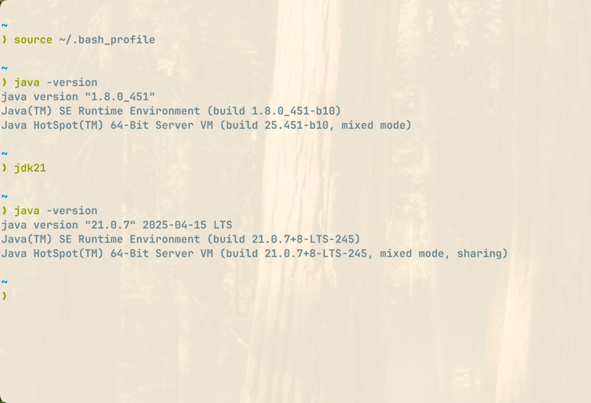
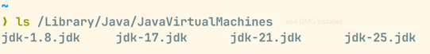
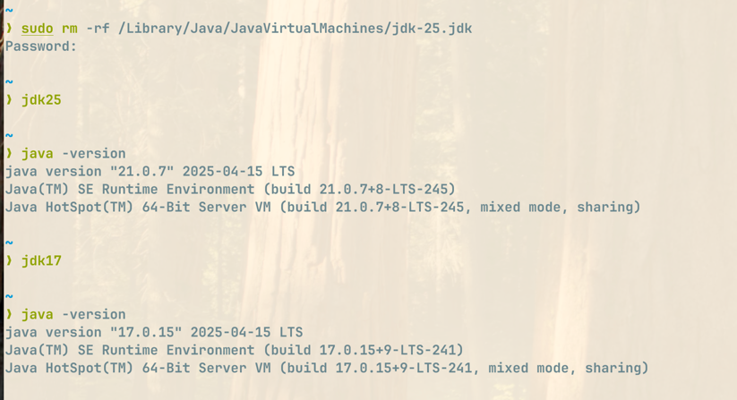

# 在 Mac 上搭建 Java 环境

## 下载安装包

进入 [Oracle 官网](https://www.oracle.com/cn/java/technologies/downloads/#jdk25-mac)，选择对应的安装包(M 系列芯片选择 ARM64 架构, Intel 则是 X64 架构);



若要下载历史版本的 JDK, 则选择 Tab 栏中的 **Java archive**，划到下面后, 点击需要的 JDK 版本即可；



鼠标往下划，即可找到对应的下载文件链接；



## 安装

下载后，双击安装包, 再双击 pkg 文件，即可开始安装, 一路默认安装即可;



然后在终端输入如下命令, 即可找到电脑中安装的 Java 和安装路径

```shell
/usr/libexec/java_home -V
```
刚刚我们安装的 JDK 25, 安装路径为: /Library/Java/JavaVirtualMachines/jdk-25.jdk/Contents/Home, 如下所示:


## 配置环境变量

在终端中运行如下命令, 打开`.bash_profile`配置文件:

```shell
vim ~/.bash_profile
```
如果不熟悉 `vim`, 也可以按步骤运行如下命令:

```shell
# 第一步，创建配置文件
touch ~/.bash_profile
# 第二步，默认文本编辑器打开,
open ~/.bash_profile
```

在配置文件中添加如下内容并保存即可:
```shell
# Java config
export JAVA_25_HOME="/Library/Java/JavaVirtualMachines/jdk-25.jdk/Contents/Home"

# config default jdk
export JAVA_HOME=$JAVA_25_HOME
export PATH="$JAVA_HOME:$PATH"
```


然后执行如下命令, 加载配置文件, 让配置生效:

```shell
source ~/.bash_profile
```

接着运行 `java -version` 如下所示, 显示 Java 版本为 25; 安装成功



## 多 Java 版本管理

在配置文件中, 进行如下配置, 并加载配置文件即可

```shell
# Java config
export JAVA_8_HOME="/Library/Java/JavaVirtualMachines/jdk-1.8.jdk/Contents/Home"
export JAVA_17_HOME="/Library/Java/JavaVirtualMachines/jdk-17.jdk/Contents/Home"
export JAVA_21_HOME="/Library/Java/JavaVirtualMachines/jdk-21.jdk/Contents/Home"
export JAVA_25_HOME="/Library/Java/JavaVirtualMachines/jdk-25.jdk/Contents/Home"
# alias，版本别名，用于在终端中切换版本
alias jdk8="export JAVA_HOME=$JAVA_8_HOME"
alias jdk17="export JAVA_HOME=$JAVA_17_HOME"
alias jdk21="export JAVA_HOME=$JAVA_21_HOME"
alias jdk25="export JAVA_HOME=$JAVA_25_HOME"
# config default jdk
export JAVA_HOME=$JAVA_8_HOME
export PATH="$JAVA_HOME:$PATH"
```

在终端输入 `jdk[版本数字]`, 即可自动切换对应的 Java 版本, 如下所示:



## 卸载 Java

在终端输入如下命令,查看安装的 Java:

```shell
ls /Library/Java/JavaVirtualMachines
```



例如删除刚刚安装的 JDK25, 则执行如下命令:

```shell
sudo rm -rf /Library/Java/JavaVirtualMachines/jdk-25.jdk
```

输入密码,成功执行命令后, 我们可以尝试将 Java 版本切换为 25, 查看是否存在



很明显,我们没有办法将 jdk 版本切换为 25, 因为已经不存在了, 也可以再次执行命令 `ls /Library/Java/JavaVirtualMachines` 查看安装的 jdk;

至此已卸载成功; 可以将配置文件中的 jdk25 相关配置信息清除, 保证卸载干净;

## 参考文章

- [Mac下安装多个版本的JDK并随意切换](https://blog.csdn.net/wo541075754/article/details/115283006)
- [MacOS上安装有多个Java版本，如何卸载？](https://blog.csdn.net/sulia1234567890/article/details/119976993)
