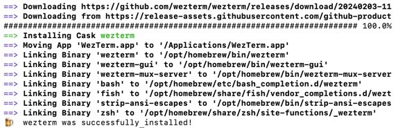
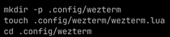
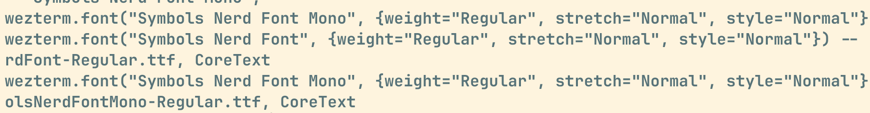
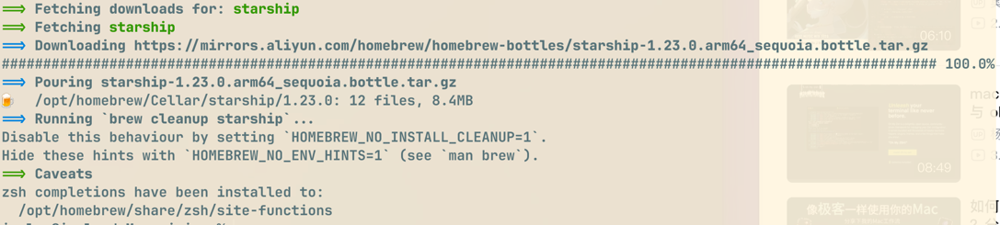
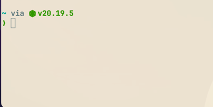

# Mac 美化终端

> 使用 Homebrew 安装相关软件

## 安装 WezTerm

[WezTerm 官网](https://wezterm.org/config/appearance.html)

执行如下命令安装：

```shell
brew install --cask wezterm
```
下载缓慢可以考虑使用代理进行下载安装：

```shell
http_proxy=http://127.0.0.1:7890 https_proxy=http://127.0.0.1:7890 brew install --cask wezterm
```


安装完成后，关闭终端，打开 WezTerm；可以为自己创建一个文件夹用来存放配置文件，WezTerm 的配置文件使用 Lua 脚本，如下所示：



接着可以使用 Lua 编写个性化配置，如下所示：

```lua
local wezterm = require("wezterm")

-- 编辑配置

-- table 数组
config = wezterm.config_builder()

config = {
    -- 自动重新加载配置
    automatically_reload_config = true,
    -- 禁用标签栏
    enable_tab_bar = false,
    -- 关闭窗口时不询问
    window_close_confirmation = "NeverPrompt", 
    -- 移除顶部图标窗口,加载大小
    window_decorations = "RESIZE",
    -- 鼠标光标样式：闪烁条形
    default_cursor_style = "BlinkingBar",
    -- 颜色主题
    color_scheme = "Solarized Light (Gogh)",
    -- 字体及大小
    font_size = 13,
    font = wezterm.font("JetBrains Mono", {weight = "Bold"}),
    -- 设置透明度
    window_background_opacity = 0.90,
    -- 设置终端窗口边界，便于提示符与终端窗口的边界分开
    window_padding = {
        left = 3,
        right = 3,
        top = 0,
        bottom = 0,
    },
    -- 窗口初始大小
    initial_cols = 120,
    initial_rows = 28,
}
-- 返回配置
return config
```

配置保存后，按快捷键 `ctrl/cmd + E` 加载配置；主题及相关配置见[官方文档](https://wezterm.org/colorschemes/s/index.html#selenized-light-gogh)。

## 安装字体

执行如下命令搜索字体，对于已安装的字体会在旁边显示`☑️`：

```shell
brew search Nerd
```


执行如下命令可以查看如何在 `WezTerm` 上配置字体，直接复制对应格式即可：

```shell
# 查看并筛选指定字体
wezterm ls-fonts --list-system | grep Nerd
```



## 安装 Starship

> [Starship 官网](https://starship.rs/)

执行如下命令：
```shell
brew install starship
```



安装成功后，需要配置 `~/.zshrc` 文件，添加如下配置：

```shell
if command -v starship &> /dev/null; then
    eval "$(starship init zsh)"
fi
```

运行 `source ~/.zshrc` 命令加载配置后，终端会变成：



如同 WezTerm 一样，创建一个专门的文件用于管理 Starship 的配置，如下所示：

```shell
touch .config/starship.toml
```

我们可以自定义配置，也可以在[官网](https://starship.rs/zh-CN/presets/#nerd-%E5%AD%97%E4%BD%93%E7%AC%A6%E5%8F%B7)中找到预设好的配置直接使用；

```toml
format = """
$directory\
$git_branch\
$git_status\
$fill\
$python\
$lua\
$nodejs\
$golang\
$haskell\
$rust\
$ruby\
$aws\
$docker_context\
$jobs\
$cmd_duration\
$line_break\
$character"""

add_newline = true
palette = "Solarized"

[directory]
style = 'bold fg:dark_blue'
format = '[$path ]($style)'
truncation_length = 3
truncation_symbol = '…/'
truncate_to_repo = false

[directory.substitutions]
'Documents' = '󰈙'
'Downloads' = ' '
'Music' = ' '
'Pictures' = ' '

[git_branch]
style = 'fg:green'
symbol = ' '
format = '[on](white) [$symbol$branch ]($style)'

[git_status]
style = 'fg:red'
format = '([$all_status$ahead_behind]($style) )'

[fill]
symbol = ' '

[python]
style = 'teal'
symbol = ' '
format = '[${symbol}${pyenv_prefix}(${version} )(\($virtualenv\) )]($style)'
pyenv_version_name = true
pyenv_prefix = ''

[lua]
format = '[$symbol($version )]($style)'
symbol = ' '

[nodejs]
style = 'blue'
symbol = ' '

[golang]
style = 'blue'
symbol = ' '

[haskell]
style = 'blue'
symbol = ' '

[rust]
style = 'orange'
symbol = ' '

[ruby]
style = 'blue'
symbol = ' '

[package]
symbol = '󰏗 '

[aws]
symbol = ' '
style = 'yellow'
format = '[$symbol($profile )(\[$duration\] )]($style)'

[docker_context]
symbol = ' '
style = 'fg:#06969A'
format = '[$symbol]($style) $path'
detect_files = ['docker-compose.yml', 'docker-compose.yaml', 'Dockerfile']
detect_extensions = ['Dockerfile']

[jobs]
symbol = ' '
style = 'red'
number_threshold = 1
format = '[$symbol]($style)'

[cmd_duration]
min_time = 500
style = 'fg:gray'
format = '[$duration]($style)'

[palettes.Solarized]
dark_blue = '#268BD2' # 深蓝色 - 用于重要状态和目录
blue = '#6C71C4'      # 蓝色 - 用于分支和链接
teal = '#2AA198'      # 青蓝色 - 用于版本信息和Python
red = '#DC322F'       # 红色 - 用于错误和警告
orange = '#CB4B16'    # 橙色 - 用于版本号和Rust
green = '#859900'     # 绿色 - 用于成功状态和Node.js
yellow = '#B58900'    # 黄色 - 用于修改状态
purple = '#D33682'    # 紫色 - 用于包管理和特殊状态
gray = '#93A1A1'      # 灰色 - 用于次要信息
black = '#002B36'     # 黑色 - 用于主要文本
white = '#FDF6E3'     # 白色 - 用于背景或高亮

[palettes.nord]
dark_blue = '#5E81AC'
blue = '#81A1C1'
teal = '#88C0D0'
red = '#BF616A'
orange = '#D08770'
green = '#A3BE8C'
yellow = '#EBCB8B'
purple = '#B48EAD'
gray = '#434C5E'
black = '#2E3440'
white = '#D8DEE9'

[palettes.onedark]
dark_blue = '#61afef'
blue = '#56b6c2'
red = '#e06c75'
green = '#98c379'
purple = '#c678dd'
cyan = '#56b6c2'
orange = '#be5046'
yellow = '#e5c07b'
gray = '#828997'
white = '#abb2bf'
black = '#2c323c'

```

## 语法高亮和补全

执行如下命令：

```shell
brew install zsh-syntax-highlighting zsh-autosuggestions
```

接着在 `~/.zshrc` 文件，添加如下配置：
```shell
# 启动终端时加载高亮
source $(brew --prefix)/share/zsh-syntax-highlighting/zsh-syntax-highlighing.zsh
# 禁用高亮中的下划线
(( ${+ZSH_HIGHLIGHT_STYLES} )) || typeset -A ZSH_HIGHLIGHT_STYLES
ZSH_HIGHLIGHT_STYLES[path]=none
ZSH_HIGHLIGHT_STYLES[path_prefix]=none
# 启用语法建议
source $(brew --prefix)/share/zsh-autosuggestions/zsh-autosuggestions.zsh
# 指定语法建议颜色
ZSH_AUTOSUGGEST_HIGHLIGHT_STYLE='fg=240'
```

