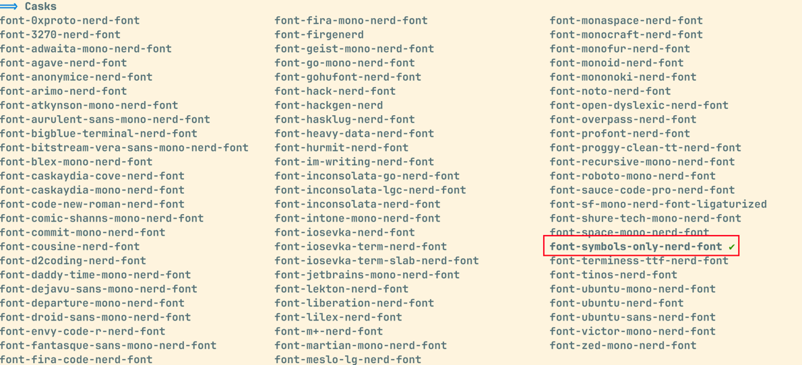

# Mac 美化终端

> 使用 Homebrew 安装相关软件

## 配置 WezTerm

[WezTerm 官网](https://wezterm.org/config/appearance.html)

执行如下命令安装：

```shell
brew install --cask wezterm
```
下载缓慢可以考虑使用代理进行下载安装：

```shell
http_proxy=http://127.0.0.1:7890 https_proxy=http://127.0.0.1:7890 brew install --cask wezterm
```


安装完成后，关闭终端，打开 WezTerm；可以为自己创建一个文件夹用来存放配置文件，WezTerm 的配置文件使用 Lua 脚本，如下所示：


接着可以使用 Lua 编写个性化配置，如下所示：

```lua
local wezterm = require("wezterm")

-- 编辑配置

-- table 数组
config = wezterm.config_builder()

config = {
    -- 自动重新加载配置
    automatically_reload_config = true,
    -- 禁用标签栏
    enable_tab_bar = false,
    -- 关闭窗口时不询问
    window_close_confirmation = "NeverPrompt", 
    -- 移除顶部图标窗口,加载大小
    window_decorations = "RESIZE",
    -- 鼠标光标样式：闪烁条形
    default_cursor_style = "BlinkingBar",
    -- 颜色主题
    color_scheme = "Selenized Light (Gogh)",
    -- 字体及大小
    font_size = 13,
    font = wezterm.font("JetBrains Mono", {weight = "Bold"}),
    -- 设置透明度
    window_background_opacity = 0.90,
    -- 设置终端窗口边界，便于提示符与终端窗口的边界分开
    window_padding = {
        left = 3,
        right = 3,
        top = 0,
        bottom = 0,
    },
    -- 窗口初始大小
    initial_cols = 120,
    initial_rows = 28,
}
-- 返回配置
return config
```

配置保存后，按快捷键 `ctrl/cmd + E` 加载配置；主题及相关配置见[官方文档](https://wezterm.org/colorschemes/s/index.html#selenized-light-gogh)。

## 安装字体

执行如下命令搜索字体，对于已安装的字体会在旁边显示`☑️`：

```shell
brew search Nerd
```



执行如下命令可以查看如何在 `WezTerm` 上配置字体，直接复制对应格式即可：

```shell
# 查看并筛选指定字体
wezterm ls-fonts --list-system | grep Nerd
```


