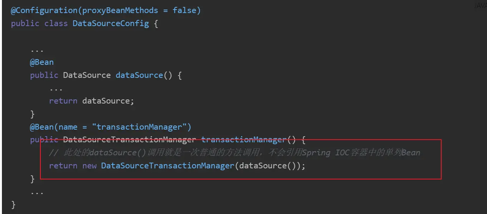

# Spring的配置类分为Full和Lite两种模式

首先查看 `@Configuration` 注解的源码, 如下所示:

```java
@Target({ElementType.TYPE})
@Retention(RetentionPolicy.RUNTIME)
@Documented
@Component
public @interface Configuration {
    @AliasFor(
        annotation = Component.class
    )
    String value() default "";

    boolean proxyBeanMethods() default true;

    boolean enforceUniqueMethods() default true;
}
```

其中属性 `proxyBeanMethods` 用来表示加载配置类使用的动态代理方式; 一般默认值为 `true`; 表示会通过 Cglib 对配置类进行增强, 因为增强后配置类会显得比较"重", 所以此时称为 Full 模式; 如果设置为 `false`, 则配置类产生的 bean 为原始对象, 相对轻量, 所以此时叫 Lite 模式;

所以Full模式和Lite模式是用来说明当前`@Configuration`中`proxyBeanMethods`属性是为false还是true, 即指加载配置类时, 配置类本身的 Bean 对象是否会被 Cglib增强;

即所谓 Full 模式 和 Lite 模式 是说配置类的 Full 模式或者 Lite 模式;

## 对比Lite模式和Full模式

### Lite模式

- 配置类本身不会被 CGLIB 增强, 放进Ioc容器内的是配置类本身;
- 对于内部类没有限制, 可以是 Full 模式或 Lite 模式;
- 配置类内部不能通过方法调用来处理依赖, 否则, 每次生成的都是一个新实例而非Ioc容器内的单例;

即按照如下所示, `datasource()` 方法不会被注入 Ioc 容器中的单例, 而是会 new 一个新的实例对象;



需要通过以下方式来配置类内部处理依赖：


- 配置类是普通Java类, 内部的 `@Bean` 方法可以使用 `private/final` 等进行修饰;

### Full模式

- 配置类会被 CGLIB 增强(生成代理对象), 放进 Ioc 容器内的是代理对象;
- 同样对内部类没有限制, 可以是 Full 模式会 Lite 模式;
- 该模式下, 配置类内部可以通过方法调用来处理依赖, 并且能保证是同一个实例, 都指向 Ioc 容器中的单例;
- 此时被增强的代理类是原始配置类的子类, 即原始配置类中 `@Bean` 方法不能被 `private/final` 修饰, 因为需要被子类继承并重写;

## 参考文章

- [Spring配置类为什么要分Full和Lite模式](https://www.cnblogs.com/54chensongxia/p/17250683.html)
